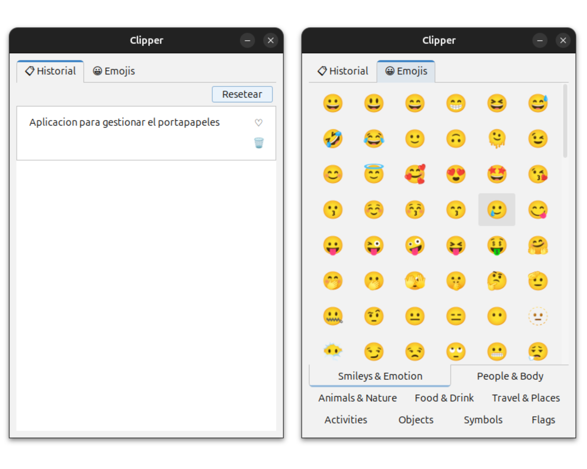

# Clipper

<p align="center" width="300">
   
   <h3 align="center">Clipper</h3>
</p>

Aplicacion para gestionar el portapapeles y lista de emojis para copiar. Programada en Java 21 y usa sqlite como base de datos.

El historial se almacena en la base de datos sqlite por lo que los registros se mantienen incluso si se cierra la aplicacion, puedes eliminar las copias manualmente si lo deseas.

<p align="center" width="500">
   
   <h3 align="center">Dashboard</h3>
</p>

## Características

1. **Portapapeles**: La aplicación monitoriza automáticamente lo que copias (Ctrl+C).
2. **Historial**: Abre la aplicación para ver y reutilizar textos copiados anteriormente.
3. **Pegado Rápido**: Haz clic en cualquier elemento del historial para minimizar la app y pegarlo automáticamente donde estabas escribiendo.
4. **Emojis**: Navega por las pestañas de emojis, haz clic en uno para pegarlo automáticamente.
5. **Gestión**: Puedes eliminar elementos del historial.

## Requisitos

- Java 21.0.5 JBR
- Maven

## Instalación

Clonar el repositorio

```bash
git clone https://github.com/Jorge-Marco5/Clipper.git
```

Cambiar al directorio del proyecto

```bash
cd Clipper
```

## Construcción

.jar y .exe (Windows)

```
mvn clean package
```

.deb (Linux)

```
./script/build_linux.sh
```

## Ejecución

Una vez compilado, puedes iniciar la aplicación desde la carpeta `target`:

```bash
java -jar target/Clipper-1.0-SNAPSHOT.jar
```

## Paquetes# Clipper

<p align="center" width="300">
   
   <h3 align="center">Clipper</h3>
</p>

Aplicacion para gestionar el portapapeles y lista de emojis para copiar. Programada en Java sqlite como base de datos.

El historial se almacena en la base de datos sqlite por lo que las copias se mantienen incluso si se cierra la aplicacion, puedes eliminarlas manualmente si lo deseas.

<p align="center" width="500">
   
   <h3 align="center">Dashboard</h3>
</p>

## Caracteristicas

1. **Portapapeles**: La aplicación monitoriza automáticamente lo que copias (Ctrl+C).
2. **Historial**: Abre la aplicación para ver y reutilizar textos copiados anteriormente.
3. **Pegado Rápido**: Haz clic en cualquier elemento del historial para minimizar la app y pegarlo automáticamente donde estabas escribiendo.
4. **Emojis**: Navega por las pestañas de emojis, haz clic en uno para pegarlo automáticamente.
5. **Gestión**: Puedes eliminar elementos del historial.

## Requisitos

- Java 21.0.5 JBR
- Maven

## Instalacion

Clonar el repositorio

```bash
git clone https://github.com/Jorge-Marco5/Clipper.git
```

Cambiar al directorio del proyecto

```bash
cd Clipper
```

## Construcción

.jar y .exe (Windows)

```
mvn clean package
```

.deb (Linux)

```
./script/build_linux.sh
```

## Ejecución

Una vez compilado, puedes iniciar la aplicación desde la carpeta `target`:

```bash
java -jar target/Clipper-1.0-SNAPSHOT.jar
```

## Paquetes

Windows

```
./target/Clipper.exe
```

Linux

```
./target/dist/Clipper-1.0-SNAPSHOT.deb
```

## Licencia

[MIT](LICENSE)

Windows

```
./target/Clipper.exe
```

Linux

```
./target/dist/Clipper-1.0-SNAPSHOT.deb
```

## Licencia

[MIT](LICENSE)
